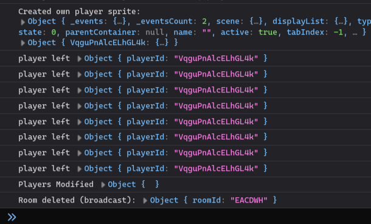

# among-us

# TOD0
- ~~player removal from room when disconnect~~
- ~~room deletion on players = 0~~
- ~~fix left movement~~
- ~~player names above heads~~
- improved game state storage -> **hell no**
- ~~add colors select system~~
- ~~room refresh system~~
- improve home UI
- add tasks system -> **hell no**
- add kill system
- ~~add impostor selection system~~
- add victory conditions
- add voting/chat/meeting system
- add sabotage system -> **hell no**
- add map -> **hell no**
- Add validations for sockets -> **maybe**
- inspect repeated player calls

it will always start the first scene, and our first scene is waiting lobby,
and there is a chance eventbus is running before the scene sets up, so we gotta
decide which scene to run based of data provided by app.jsx, about if the game
has been started or not
